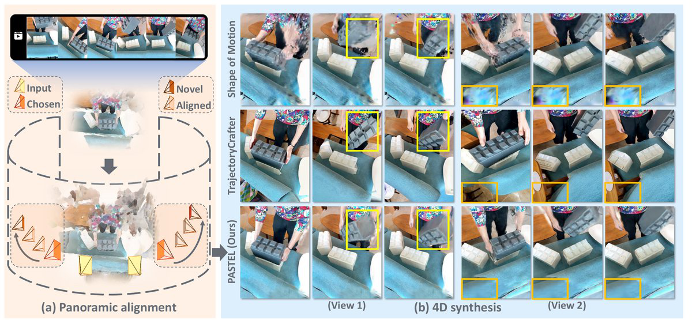
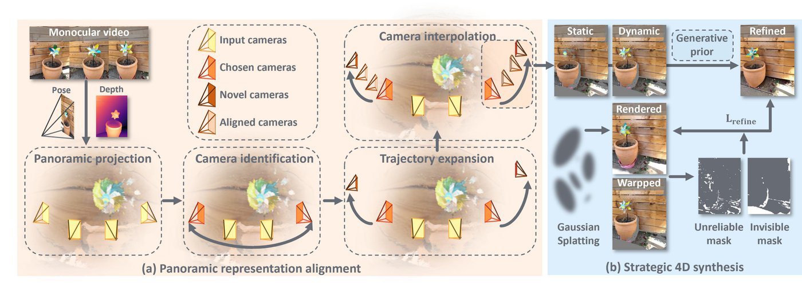

<h1 align="center">PASTEL: Panoramic Alignment for Monocular 4D Scene Reconstruction</h1>

<p align="center">
  <a href="PASTEL_ECCV2026.pdf">Paper</a>
</p>

<p align="center">
  <a href="https://yangyuankun865.github.io/">Yuankun Yang</a><sup>1</sup>,
  Yi Wei<sup>2</sup>,
  Bo Bai<sup>2</sup>,
  Wenyang Zhou<sup>2</sup>,
  <a href="https://lzrobots.github.io/">Li Zhang</a><sup>1</sup> ✉
</p>

<p align="center">
  <sup>1</sup>School of Data Science, Fudan University &nbsp;&nbsp;
  <sup>2</sup>Central Media Technology Institute, Huawei
</p>

<p align="center"><strong>ECCV 2026</strong></p>

<p align="center">
  
</p>

**PASTEL** targets monocular 4D scene synthesis beyond visible camera limits. It aligns the scene into a panoramic representation, plans adaptive extrapolation trajectories, and strategically exploits generative priors to synthesize invisible regions while preserving consistency with the input video.

## Method

**PASTEL** reformulates 4D scene synthesis through panoramic alignment:

- **Panoramic scene alignment** maps back-projected observations into a unified panoramic domain with explicit visibility boundaries.
- **Adaptive trajectory identification** selects expansion directions that maximize out-of-view exploration with minimal deviation from the original cameras.
- **Comprehensive view expansion & strategic supervision** warps static and dynamic content along designed trajectories, then distills generative outputs only into invisible and unreliable regions.

<p align="center">
  
</p>

Given a monocular video, PASTEL first performs panoramic representation alignment and trajectory identification, then conducts static–dynamic view expansion and strategic 4D synthesis guided by generative priors.

## BibTeX

If you find this project helpful, please consider citing our [paper](PASTEL_ECCV2026.pdf):

```bibtex
@inproceedings{yang2026pastel,
  title     = {{PASTEL}: Panoramic Alignment for Monocular 4D Scene Reconstruction},
  author    = {Yang, Yuankun and Wei, Yi and Bai, Bo and Zhou, Wenyang and Zhang, Li},
  booktitle = {European Conference on Computer Vision (ECCV)},
  year      = {2026}
}
```
